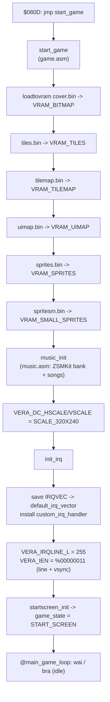

# 01 — Boot, Asset Load & IRQ Setup

Source: `game.asm` (`start_game`, `init_irq`), `loadfiledata.asm`.

## Boot sequence

## `init_irq` detail

1. `sei` — disable IRQs while swapping the vector.
2. Back up `IRQVEC`/`IRQVEC+1` into `default_irq_vector` (the KERNAL handler is
   still reached via `jmp (default_irq_vector)` at the end of the custom handler).
3. Install `custom_irq_handler` into `IRQVEC`.
4. `VERA_IRQLINE_L = %11111111` (255) and `VERA_IEN = %00000011` — enable the
   scanline IRQ **and** the vsync IRQ.
5. `cli`, then `stz pause_cooldown`, then `startscreen_init`.

## Notes

- The `@main_game_loop` is just `wai` + `bra`: **all** logic runs in interrupt
  context, so a bug inside the IRQ freezes the whole machine.
- Asset filenames live at the top of `loadfiledata.asm`:
  `tilemap.bin`, `sprites.bin`, `spritesm.bin`, `tiles.bin`, `cover.bin`,
  `uimap.bin`.
- `loadtovram` takes `.A` = high nibble of the VRAM address, `.X` = low nibble,
  `.Y` = low byte of the filename pointer.

## Debug hooks

| Check | Where |
|---|---|
| Assets garbled / missing | `loadfiledata.asm` filenames + `loadtovram` args |
| Tick never fires | `init_irq` vector install and `VERA_IEN` |
| Start screen wrong | `startscreen_init` (see `04-state-machine.md`) |
