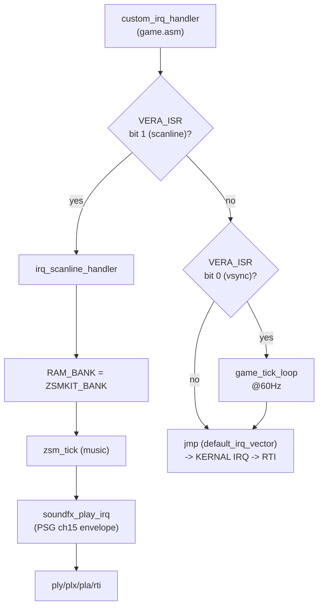
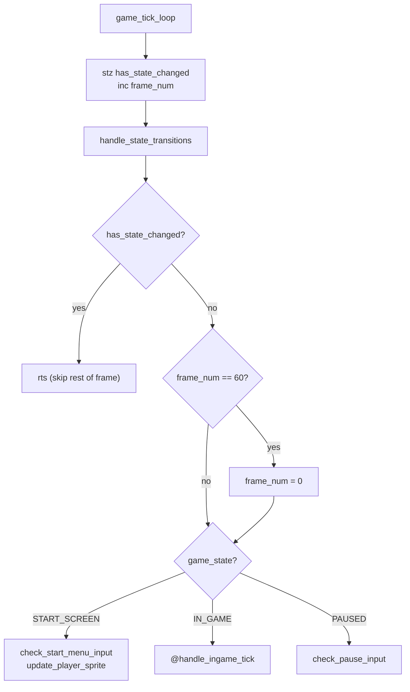
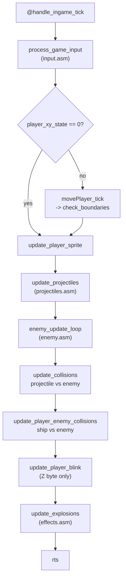

# 02 — IRQ, Tick Dispatch & Frame Order

Source: `game.asm` (`custom_irq_handler`, `irq_scanline_handler`,
`game_tick_loop`, `@handle_ingame_tick`).

## IRQ routing

## `game_tick_loop` — state dispatch

`has_state_changed` short-circuits the frame entirely. A state transition takes
`state_trans_delay` frames (see `04-state-machine.md`), so "one frame did
nothing" right after a menu press is expected.

## In-game tick order (order is significant)

### Why the order matters

- `process_game_input` runs first so a fire press is consumed by
  `fire_projectile` before projectiles are moved/rendered this frame.
- `spawn_explosion` (called from `update_collisions`) reads the `enemy_x/y_pos`
  scalars, so it must run while they still hold the dead enemy's position.
- `update_player_blink` writes **only** the player sprite's Z byte
  (`sp_att_player + 6`). Do not duplicate that logic in `update_player_sprite`.
- `update_explosions` runs last so a freshly spawned explosion is drawn on its
  first frame.

## Debug hooks

| Check | Where |
|---|---|
| Stuck / total freeze | `custom_irq_handler` — CPU spinning inside the IRQ (see README gotchas) |
| No music or SFX | `irq_scanline_handler` — bank select, `zsm_tick`, `soundfx_play_irq` |
| Player won't move | `process_game_input` sets `player_xy_state`; `movePlayer_tick` consumes it |
| Player leaves screen | `check_boundaries` (called from `movePlayer_tick`) |
