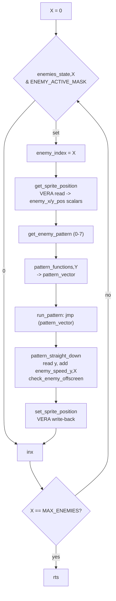
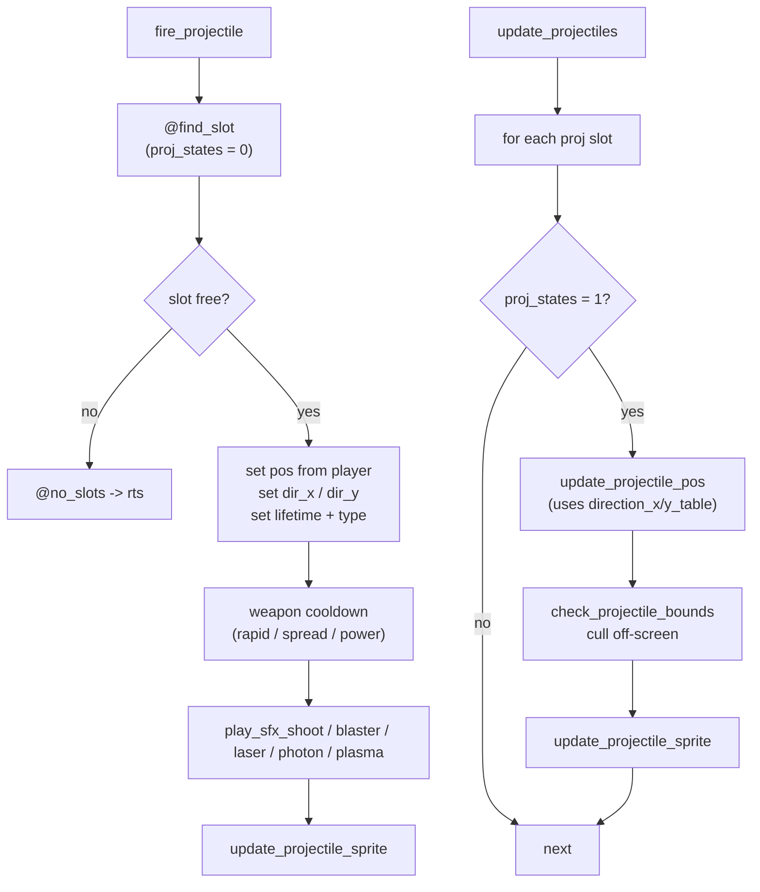
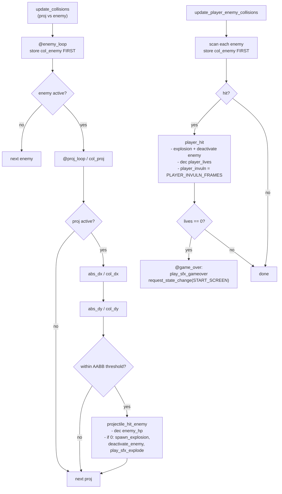
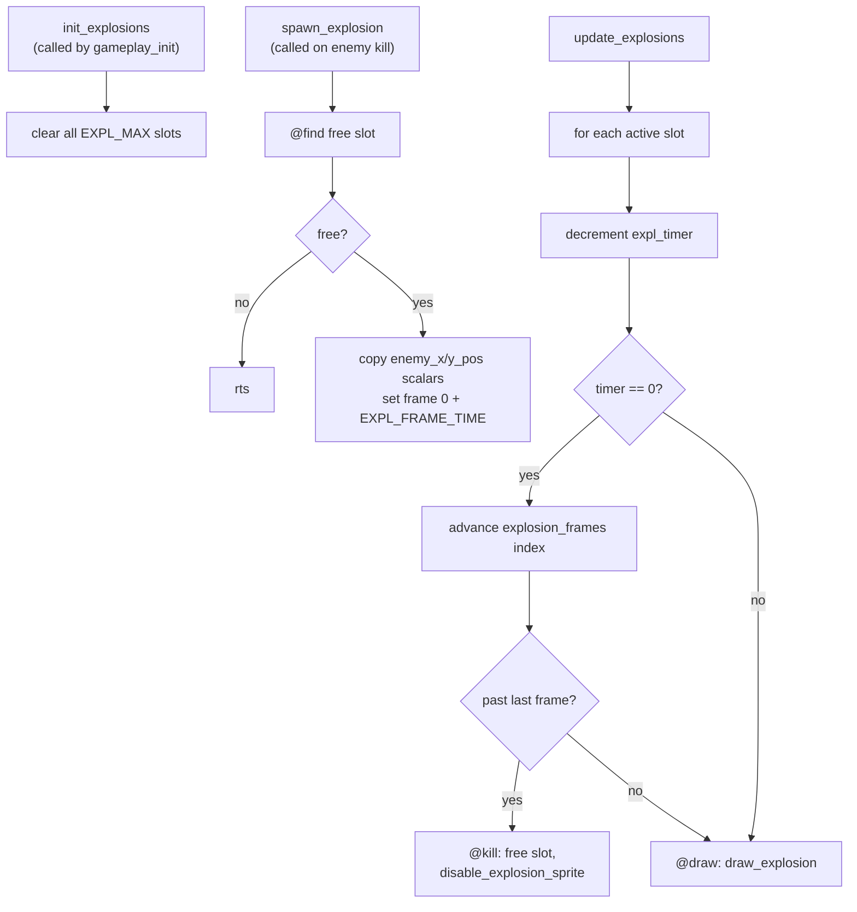

# 03 — Gameplay Loops

Source: `enemy.asm`, `projectiles.asm`, `collision.asm`, `effects.asm`.

## Enemy update dispatch (`enemy_update_loop`)

### Pattern contract

- `.X` = enemy index and **must be preserved**; read/write the `enemy_x/y_pos`
  scalars (not per-enemy arrays — those are scalars in the current build).
- Patterns must **not** touch VERA; the loop does the single write-back.
- `run_pattern` is `jmp (pattern_vector)`; the caller's `jsr run_pattern` leaves
  the return address so the pattern's `rts` lands correctly (no
  self-modifying code needed).
- `pattern_functions` has 8 `.word` entries (pattern ID is 3 bits). Only entry 0
  (`pattern_straight_down`) is implemented; 1-7 alias it as placeholders.
- Patterns may call `check_enemy_offscreen` / `deactivate_enemy` (both live in
  `enemy.asm`). `check_enemy_offscreen` culls **vertically only**.
- `activate_enemy` sets the active bit, resets `enemy_hp`, and clears all
  pattern state. **Any new spawn path must set the active bit** or collision
  will skip the enemy.

## Projectile lifecycle (`projectiles.asm`)

- Pool: `PROJ_MAX_COUNT` slots with `proj_states`, `proj_x/y_pos_l/h`,
  `proj_dir_x/y`, `proj_lifetime`, `proj_type`.
- `proj_cooldown` is a single global cooldown shared by all weapons.
- Known TODO in the current build: `update_projectile_sprite` hardcodes
  `lda #5` for the frame and `lda #0` for direction.

## Collision pipeline (`collision.asm`)

- Geometry: sprite coords are **top-left corners**. 8x8 player projectile
  (half 4) vs 16x16 enemy (half 8) -> centre test biases the delta by
  `ENEMY_HALF - PROJ_HALF = 4` before `abs_dx`/`abs_dy`.
- The ship hitbox is a small centred core: `PLAYER_HIT_HALF = 3` (6x6),
  `PLAYER_HIT_THRESH = 3 + 8 = 11`, biased by 5.
- While `player_invuln != 0`, `update_player_enemy_collisions` decrements it and
  **returns** — enemies pass through and no life is lost.
- **`col_enemy` must be stored at the top of the loop, before the active-mask
  skip.** Storing it after the skip makes the loop reload a stale index and spin
  forever inside the IRQ (total freeze).
- Relative branches only reach +/-128 bytes here; use a nearby `beq`/`bne`
  trampoline then `jmp` for far targets.

## Explosions (`effects.asm`)

- 5 slots at `sp_att_effects = $1FF88` (ends at `$1FFB0` = `sp_att_ui`).
- Uses big-sprite frames `$0F`/`$10` ("FlameSprites" in `sprites.bin`).
- `spawn_explosion` reads the `enemy_x/y_pos` scalars — call it while they still
  hold the dead enemy's position (order matters; see `02-irq-and-tick.md`).
- Tuning knobs: `EXPL_FRAME_TIME`, `explosion_frames`, `EXPL_MAX`.
