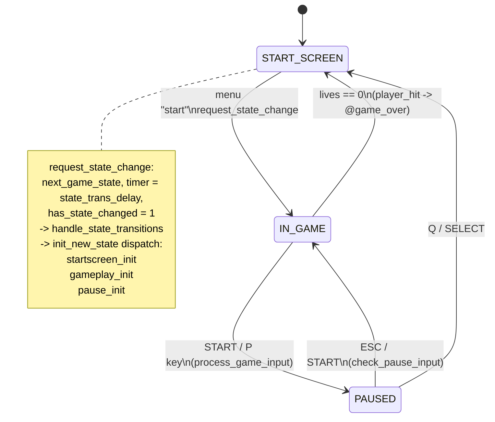
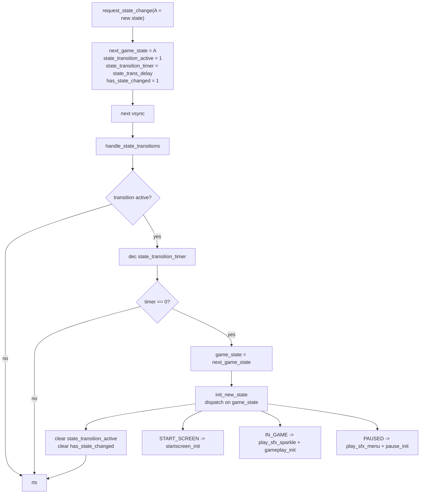

# 04 — State Machine & Screen Init

Source: `game.asm` (`request_state_change`, `handle_state_transitions`,
`init_new_state`, `gameplay_init`, `startscreen_init`, `pause_init`),
`input.asm`.

## Transitions

## Transition mechanics

Because `has_state_changed` is set on the *request* frame and `game_tick_loop`
returns early when it is set, the requested frame and the transition frame both
skip normal tick logic. See `02-irq-and-tick.md`.

## Screen init routines

| Routine | Purpose | Key steps |
|---|---|---|
| `gameplay_init` | Set up the play field | Layer 0 = `LAYERCONFIG_64X324BPP` + tilemap/tiles; Layer 1 = `LAYERCONFIG_64X32UI` + UIMAP/PETSCII; write player sprite attrs; `build_sprite_ui`, `enemy_init`, `init_projectiles`, `init_explosions`, `player_reset`; `VERA_DC_VIDEO = %01110001` (sprites + L1 + L0) |
| `startscreen_init` | Title screen | Layer 0 = `LAYERCONFIG_BITMP4BPP` + cover bitmap; `joystick_latch = $CF`; `clear_all_sprites`; `stz player_invuln`; reset menu cursor to (99,132) index 0; `VERA_DC_VIDEO = %01010001` (sprites + L0); `game_state = START_SCREEN` |
| `pause_init` | Pause overlay | Clear 4096 bytes of `VRAM_TEXTMAP`; Layer 1 = `LAYERCONFIG_TEXT64X32`; `VERA_DC_VIDEO = %00110001` (sprites **off**, L1 + L0); print `pause_title` / `pause_resume_hint` / `pause_quit_hint` |

## Pause screen specifics

- Text map must be **>= 40 tiles wide** on the 40-column screen or VERA wraps
  and mirrors cols 0-7 at the right edge (symptom: stray leading chars like
  `ESC`/`Q`).
- `VRAM_TEXTMAP` ($0C000) + 64*32*2 = `$0D000` exactly meets `VRAM_TILEMAP` — no
  overlap, but no headroom either.
- Row stride for a 64-wide 1bpp map is **128 bytes**.
- Layout: `PAUSED` row 12 col 17, resume hint row 14 col 9, quit hint row 16
  col 10.
- The clear loop writes **2 bytes/iteration x 256 = 512 bytes** per outer pass,
  so `ldx #8` = 4096 bytes. Raising it overruns `$0CFFF` into `VRAM_TILEMAP`
  and corrupts the game background.
- `pause_init` disables sprites (`DC_VIDEO = $31`), `startscreen_init`
  re-enables them (`$51`) — leftovers reappear unless cleared, which is why
  `startscreen_init` calls `clear_all_sprites`.

## Input handlers per state

| State | Handler | Keys / inputs |
|---|---|---|
| START_SCREEN | `check_start_menu_input` | up/down (+ `menu_delay`), start to begin |
| IN_GAME | `process_game_input` | move, fire (`@check_fire` / `@check_autofire`), pause (`@pause_game`), `M` mute, `-`/`+` volume |
| IN_GAME | `check_pause_input` (polled via ESC) | ESC / START = resume; Q / SELECT = quit to menu |
| PAUSED | `check_pause_input` | ESC / START = resume; Q / SELECT = quit to menu |

Note: keyboard **Left-Shift maps to SELECT**, and the music mute/volume keys are
handled only in `process_game_input` — not in the start-screen or pause handlers.
