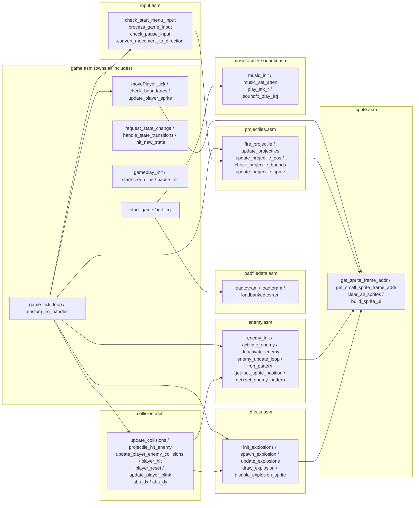

# 05 — File / Routine Map

Which file owns what. `game.asm` owns all `.include`s, so include order matters.

## Include order

```
x16.inc
macros.inc
loadfiledata.asm
globals.asm
sprite.asm
input.asm
projectiles.asm
soundfx.asm
music.asm
enemy.asm
collision.asm
effects.asm
; enemypatterns.asm   <- COMMENTED OUT (draft, does not compile)
; ui.asm              <- NOT included
; sinewaves.asm       <- only used once enemypatterns.asm is enabled
```

## Ownership graph



## Routine reference

### `game.asm` — Core / Engine
- `start_game` — entry point; loads assets, sets scale, calls `init_irq`.
- `init_irq` — saves/installs the IRQ vector, enables VERA line + vsync IRQs.
- `@main_game_loop` — `wai`/`bra` idle; all work happens in IRQ context.
- `game_tick_loop` — per-frame dispatch on `game_state`.
- `custom_irq_handler` / `irq_scanline_handler` — IRQ routing.
- `movePlayer_tick`, `check_boundaries`, `update_player_sprite` — player motion.
- `gameplay_init`, `startscreen_init`, `pause_init`, `unpause`.
- `request_state_change`, `handle_state_transitions`, `init_new_state`.

### `globals.asm`
Zero-page assignments, screen boundaries, VERA layer configs, game-state IDs,
player/sprite state, and on-screen text strings (including `pause_title`,
`pause_resume_hint`, `pause_quit_hint`).

### `macros.inc`
`MACRO_VERA_SET_ADDR` (point a VERA data port at a VRAM address with a stride),
`MACRO_SETLFS` (set up a KERNAL logical file).

### `x16.inc`
Hardware definitions: VERA registers and VRAM addresses, IRQ vectors, RAM/ROM
bank registers, KERNAL jump-table entries.

### `loadfiledata.asm`
Asset filenames and `loadtovram` / `loadtoram` / `loadbankedtovram`.

### `input.asm`
`check_start_menu_input`, `process_game_input`, `check_pause_input`,
`convert_movement_to_direction`.

### `sprite.asm`
Sprite attribute address map (`sp_att_player`, `sp_att_playermisc`,
`sp_att_playerproj`, `sp_att_enemy`, `sp_att_effects`, `sp_att_ui`),
`get_sprite_frame_addr` / `get_small_sprite_frame_addr`, `clear_all_sprites`,
`build_sprite_ui`.

### `projectiles.asm`
Player bullet pool (10 slots) plus `fire_projectile`, per-frame movement,
off-screen culling and sprite updates.

### `enemy.asm`
`enemies_state` bit-field, per-enemy pattern state arrays, VERA position
read/write helpers, `enemy_update_loop`, `activate_enemy`, `deactivate_enemy`,
`hide_enemy_sprite`, `check_enemy_offscreen`, `pattern_functions`,
`pattern_straight_down`.

### `collision.asm`
`update_collisions`, `projectile_hit_enemy`, `update_player_enemy_collisions`,
`player_hit`, `player_reset`, `update_player_blink`, `abs_dx` / `abs_dy`, and the
`enemy_hp` table.

### `effects.asm`
5-slot explosion pool: `init_explosions`, `spawn_explosion`, `update_explosions`,
`draw_explosion`, `disable_explosion_sprite`.

### `music.asm`
ZSMKit bank load, song load/start, `music_init`, `music_set_atten`,
`music_toggle_mute`, `music_volume_up`, `music_volume_down`.

### `soundfx.asm`
10-byte PSG envelopes (`sfx_sounds` table), `play_sfx_*` entry points,
`common_sfx_play`, `soundfx_play_irq` (runs from the scanline IRQ on PSG
channel 15).

## Not currently compiled

| File | Status |
|---|---|
| `enemypatterns.asm` | Draft; references undefined symbols (`enemy_speed,x`, `update_enemy_sprite`, `player_x_pos_l`, bogus `$C000` equates) and duplicates the pattern table now in `enemy.asm` |
| `sinewaves.asm` | 256-entry sine table + `get_sine` / `get_cosine`; only used once `enemypatterns.asm` is enabled |
| `ui.asm` | Draft HUD readouts (score / level / powerup); references undefined symbols and a `MACRO_PRINT_STRING` that does not exist |
